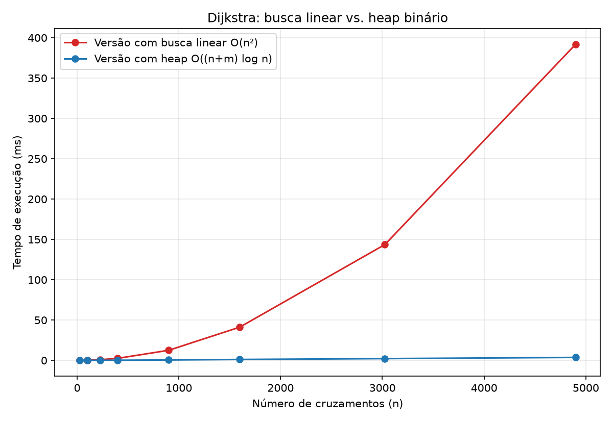
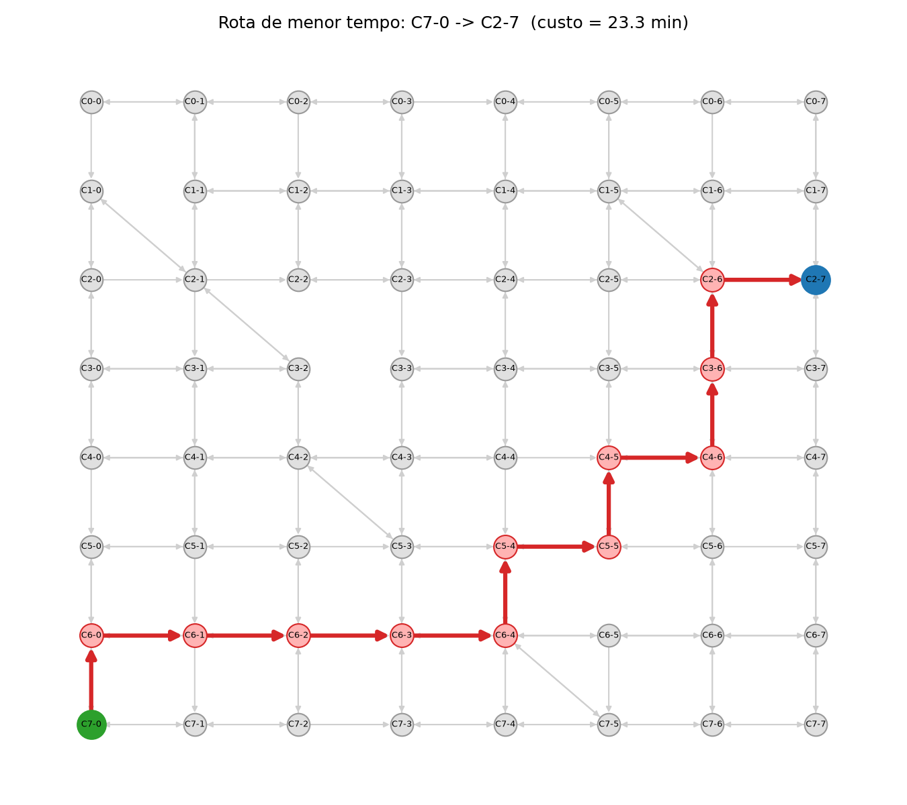
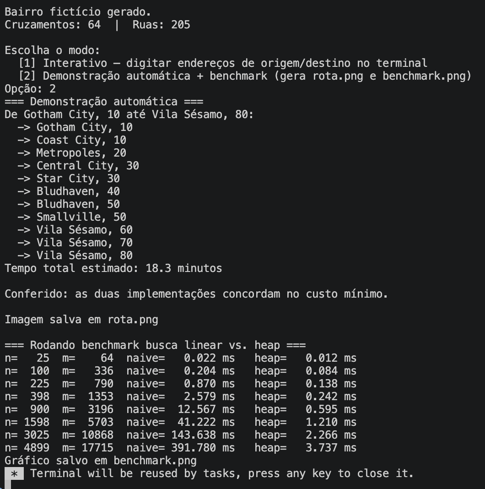

# G34_Grafos_2026.2

Trabalho 1 
Conteúdo da Disciplina: Grafos 

## Alunos
|Matrícula | Aluno |
| -- | -- |
| 21/1063256  |  Victor Hugo Rodrigues Guimarães |
| 21/1063229  |  Pedro Henrique dos Santos Ferreira |

## Sobre 
Projeto desenvolvido para aplicar o algoritmo de Dijkstra na busca pelas menores rotas em um grafo. A aplicação calcula o caminho de menor custo entre dois pontos, considerando os pesos das arestas, e apresenta a rota encontrada e sua distância total.

## Screenshots

### Benchmark comparativo entre versão linear e versão com heap

### Menor caminho encontrado a partir da saída e destino

### Terminal com logs da aplicação executada

## Video 
https://youtu.be/_UTHp49Zj1Y

## Instalação 
Linguagem: Python 

## Uso 
Execute o código da main.py
Digite 1 para versão interativa e 2 para versão automática